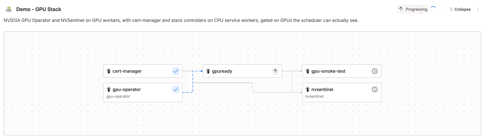

# NVIDIA GPU Operator Stack Demo

vCluster Platform hands you a complete NVIDIA GPU cluster, not an empty one. A single Stack delivers cert-manager, the NVIDIA GPU Operator, and NVSentinel with the tenant cluster itself, through Argo CD, in dependency order, onto GPU nodes that are already labeled, tainted, and ready for CUDA workloads.

**Stacks** are a recent addition to vCluster Platform, and they are the point of this demo. One `StackTemplate` declares a dependency-aware task graph, each task becomes an Argo CD Application, and a task starts only once every task in its `dependsOn` list reports healthy. Attach that template to a tenant cluster template under `deploy.stacks` and the cluster arrives with its software already converging. No second pipeline, no post-provisioning runbook, no ticket to go install the GPU Operator after the nodes join.

The `demo-gpu` Stack runs cert-manager and the NVIDIA GPU Operator in parallel, then a readiness gate that holds until the scheduler actually advertises a GPU, then NVSentinel and a CUDA smoke test side by side. Eight parameters flow from the tenant cluster template through the Stack and into each application's Helm values, so one form in the Platform UI configures GPU driver mode, chart versions, the Argo CD project, node placement, and whether cert-manager gets installed at all.

Two NodeProfiles split the workers: `cpu-services` labels its nodes `workload.example.com/pool=cpu-services` and stays untainted, so it carries cert-manager and the service controllers, while `gpu-compute` labels its nodes `workload.example.com/pool=gpu-compute` and carries a permanent `nvidia.com/gpu=true:NoSchedule` taint that reserves GPU workers for NVIDIA node agents and GPU workloads with a matching toleration. Both pools are provisioned from `privateNodes.autoNodes`, each picked by a `nodeTypeSelector` on `vcluster.com/profile` (`xlarge-gpu` for GPU, `small` for CPU), and every placement decision in the stack keys off the pool label plus that taint.

This repository contains the Platform templates and profiles. It uses existing Platform, Argo CD, and node-provider infrastructure; it does not install those prerequisites.

## Repository contents

Everything Platform owns lives under `vcluster-platform/`, in subfolders named after the vCluster Platform left navigation. Each manifest sits where you would go in the UI to find the object it creates.

### `vcluster-platform/infra-management/`

Platform nav: **Infra Management → Nodes & Providers**, the Node Profiles tab.

| File | Purpose |
| --- | --- |
| [node-profiles.yaml](vcluster-platform/infra-management/node-profiles.yaml) | `cpu-services` NodeProfile (pool label only) and `gpu-compute` NodeProfile (pool label plus the `nvidia.com/gpu=true:NoSchedule` taint) |

### `vcluster-platform/tenant-management/`

Platform nav: **Tenant Management**. The tenant cluster template appears under Cluster Templates; the Stack and its application templates appear under Stacks & Apps.

| File | Purpose |
| --- | --- |
| [virtual-cluster-template.yaml](vcluster-platform/tenant-management/virtual-cluster-template.yaml) | `demo-static-gpu`, which provisions the GPU and CPU worker pools and attaches the Stack through `deploy.stacks` |
| [stack-template.yaml](vcluster-platform/tenant-management/stack-template.yaml) | `demo-gpu`, the Stack: a five-task graph that installs cert-manager and GPU Operator in parallel, gates on real GPU readiness, then runs NVSentinel and a CUDA smoke test side by side |
| [cert-manager-application-template.yaml](vcluster-platform/tenant-management/cert-manager-application-template.yaml) | `demo-cert-manager`, with CPU placement for all cert-manager components |
| [cert-manager-check-application-template.yaml](vcluster-platform/tenant-management/cert-manager-check-application-template.yaml) | `demo-cert-manager-check`, the "already installed" variant of the cert-manager task. Installs nothing |
| [gpu-operator-application-template.yaml](vcluster-platform/tenant-management/gpu-operator-application-template.yaml) | `demo-gpu-operator`, with CPU controllers and GPU node agents |
| [stack-gate-application-template.yaml](vcluster-platform/tenant-management/stack-gate-application-template.yaml) | `demo-stack-gate`, the reusable readiness gate: a Job that waits, verifies, and publishes a contract |
| [gpu-smoke-test-application-template.yaml](vcluster-platform/tenant-management/gpu-smoke-test-application-template.yaml) | `demo-gpu-smoke-test`, the CUDA sample that runs in parallel with NVSentinel |
| [nvsentinel-application-template.yaml](vcluster-platform/tenant-management/nvsentinel-application-template.yaml) | `demo-nvsentinel`, configured for dry-run monitoring, with the DCGM address supplied by the gate |

### Repository root

Not Platform objects. These are what Argo CD and the container build consume, and their paths are referenced by the templates above, so moving them means updating `chartPath` and the workflow.

| Path | Purpose |
| --- | --- |
| [charts/stack-gate/](charts/stack-gate/) | The Helm chart both gate templates deploy: ServiceAccount, least-privilege RBAC, and the gate Job |
| [charts/gpu-smoke-test/](charts/gpu-smoke-test/) | The CUDA VectorAdd Job, with the GPU pool selector, taint toleration, and a GPU request |
| [gate/stack-gate.sh](gate/stack-gate.sh) | The gate itself. Waits, counts allocatable capacity, writes the contract ConfigMap |
| [Dockerfile](Dockerfile) | Builds the gate image: upstream `kubectl` on Alpine, running as UID 65532 |
| [.github/workflows/publish-image.yaml](.github/workflows/publish-image.yaml) | Builds and pushes that image to GHCR, multi-architecture |
| [.github/workflows/publish-chart.yaml](.github/workflows/publish-chart.yaml) | Packages both charts and pushes them to GHCR as OCI artifacts, on release |
| [docs/stack-gate.md](docs/stack-gate.md) | The reusable gate: how it works, every parameter, and how to point it at something else |

All commands below run from the root of your clone of this repository. No parent repository or sibling directory is needed.

## How the Stack works

A Stack deploys several applications as one dependency-aware unit and defines the order in which they become ready. Two resources carry it:

- **`StackTemplate`** is the reusable, parameterized task graph an administrator publishes once. [stack-template.yaml](vcluster-platform/tenant-management/stack-template.yaml) is this demo's.
- **`StackInstance`** is that graph applied to one tenant cluster. Platform creates it when the tenant cluster is provisioned, drives each task, and aggregates the task phases into one status.

Tasks form a directed acyclic graph. Tasks with no dependencies run concurrently; a task with `dependsOn` waits until every task it names is healthy, not merely created. That is the difference between a Stack and a list of Helm installs:

| Task | `dependsOn` | Timeout | Deploys |
| --- | --- | --- | --- |
| `cert-manager` | none | `15m0s` | `demo-cert-manager`, or `demo-cert-manager-check` when cert-manager is already installed |
| `gpu-operator` | none | `45m0s` | `demo-gpu-operator` application template |
| `gpuready` | `gpu-operator` | `45m0s` | `demo-stack-gate`: the Job that holds until GPUs are real |
| `dcgmready` | `gpu-operator` | `15m0s` | `demo-stack-gate` again: waits for the DCGM host engine |
| `gpu-smoke-test` | `gpuready` | `15m0s` | `demo-gpu-smoke-test`: a CUDA sample on the GPU pool |
| `nvsentinel` | `gpuready`, `dcgmready`, `cert-manager` | `20m0s` | `demo-nvsentinel` application template |

Two gates run in parallel off `gpu-operator`, because the two downstream tasks need different things. `gpu-smoke-test` needs a schedulable GPU, so it waits on `gpuready` alone and starts as soon as the scheduler advertises one. `nvsentinel` needs a schedulable GPU **and** a DCGM host engine it can dial, so it waits on both gates plus cert-manager.

`dcgmready` exists because the GPU Operator creates `dcgm-exporter` and `nvidia-dcgm` at the same instant with nothing ordering them, so on a cold start NVSentinel can begin against a DCGM that is not serving and report `GpuDcgmConnectivityFailure`. It is the same `demo-stack-gate` template with different parameters, publishing no contract and checking no capacity. See [docs/stack-gate.md](docs/stack-gate.md).

Write those timeouts in full Go duration form, seconds included. `timeout` and `defaults.taskTimeout` are `metav1.Duration` fields, so the API server stores them canonically: apply `45m` and read back `45m0s`. If the StackTemplate is itself managed by Argo CD, that one-character difference is permanent drift and the Application never reaches Synced. Argo CD's own `retry.backoff` durations in the application templates are plain strings and are left as written.

The ordering is load-bearing here. NVSentinel scrapes DCGM on a service that does not exist until GPU Operator is healthy, and on a fresh node image GPU Operator has a driver to build and validate first. `dependsOn` and the generous timeouts encode that wait once, in the template, instead of in a runbook or a retry loop.

A task is ready only when its Argo CD Application reports **both** `Synced` and `Healthy`, and only after every output it declares has been captured. That pair of conditions is what makes the gate below work.

Parameters flow down the same path. `cpuNodePool`, `argoProject`, `driverPreinstalled`, `certManagerPreinstalled`, `minGPUs`, `gpuOperatorVersion`, and `nvsentinelVersion` are declared on the tenant cluster template, passed to the Stack under `deploy.stacks[].parameters`, and forwarded by each task into its application template. Change `driverPreinstalled` at cluster creation and both GPU Operator and NVSentinel switch driver modes together.

Each task here is an `argoCDApplication`, so Argo CD owns reconciliation and drift correction once the Stack has ordered the rollout. Tasks can also be `app`, creating an `AppInstance`, and a single Stack may mix both.

## The gpuready gate

The GPU Operator Application goes `Healthy` as soon as Argo CD has created its resources. That is minutes to an hour before a driver is built, the device plugin has registered, and the scheduler will admit a pod asking for `nvidia.com/gpu`. Anything depending on GPU Operator being *useful* rather than merely installed needs a stronger signal, and a custom Argo CD health check cannot travel inside a Stack.

So the Stack derives the signal from a kind Argo CD already understands. Argo CD's built-in Job health reports `Progressing` while a Job runs and `Healthy` only when it completes, so `gpuready` deploys an Application containing exactly one Job. That Job waits until the scheduler actually advertises `minGPUs`, then writes the `gpu-stack-contract` ConfigMap in the `gpu-stack` namespace, last, so its existence is the signal.



*The gate doing its job. GPU Operator has reported healthy, so a Stack without this task would already be installing NVSentinel against a cluster with no schedulable GPU. Instead `gpuready` holds, and both downstream tasks wait with it.*

`gpuready` declares Stack outputs read from that contract, and `nvsentinel` consumes them, so the DCGM address is passed rather than hard-coded:

```yaml
parameters:
  dcgmHost: '{{ .Outputs.gpuready.dcgmhost }}'
```

By default the gate does not wait on `ClusterPolicy`. `ClusterPolicy` aggregates every GPU Operator operand, so it stays `notReady` while `dcgm-exporter` loses a startup race that nothing downstream cares about, which cost about 90 seconds in a measured run. Set `waitForClusterPolicy` to hold for the whole operand set instead.

**The gate is reusable, and this Stack uses it three times.** How to point it at something else, the full parameter reference, and worked examples beyond this demo are in [docs/stack-gate.md](docs/stack-gate.md).

## The GPU smoke test

`gpu-smoke-test` runs NVIDIA's CUDA VectorAdd sample as a Job on the GPU pool, in parallel with NVSentinel. It carries the pool selector, a toleration for the `nvidia.com/gpu=true:NoSchedule` taint, and a request for one whole GPU, and it takes its pool from the gate's contract rather than a hard-coded value:

```yaml
parameters:
  gpuPool: '{{ .Outputs.gpuready.gpupool }}'
```

The same Argo CD Job health applies, so the task is green only once a CUDA workload really ran on a GPU worker and exited 0. That is a stronger claim than the gate's: the gate proves the scheduler will admit a GPU pod, the smoke test proves the GPU computes. It occupies one GPU for the few seconds it takes.

Note the hyphen in the task name, where `gpuready` has none. The rule is narrow: a task that declares outputs must be letters and digits only. `gpu-smoke-test` declares none, so it can be named normally.

## Skipping cert-manager when it is already installed

A Stack task cannot be skipped. There is no `when`, `if`, `enabled`, or `skipIf` field: the task schema is `name`, `dependsOn`, `argoCDApplication`, `app`, `timeout`, and `outputs`, and the only ordering control is `dependsOn`. A task whose dependencies are unmet waits; it is never dropped.

What is templated is every string in the task, including the name of the template it references. So the cert-manager task switches targets instead of disappearing:

```yaml
- name: cert-manager
  argoCDApplication:
    templateRef:
      name: 'demo-cert-manager{{ if eq (.Values.certManagerPreinstalled | toString) "true" }}-check{{ end }}'
    parameters:
      cpuNodePool: '{{ .Values.cpuNodePool }}'
      project: '{{ .Values.argoProject }}'
```

Set `certManagerPreinstalled` at cluster creation and the task deploys `demo-cert-manager-check`, which installs nothing. It runs the same gate chart against the cert-manager that is already there, waiting for `deployment/cert-manager-webhook` in the `cert-manager` namespace to report `Available`. Both templates accept the same two parameters, so one parameter map serves either one.

Verifying beats skipping. If the cluster was declared to have cert-manager and does not, the task fails with a clear reason instead of letting NVSentinel start against a cluster that cannot issue certificates. The `nvsentinel` dependency edge stays honest in both modes.

## Prerequisites

- vCluster Platform 4.13 with the features and permissions needed for Private Nodes, NodeProfiles, Stacks, and Argo CD integration. Stacks need no separate license feature; the Argo CD task type uses the Argo CD integration you already have.
- vCluster 0.37 or later for the `deploy.stacks` install path. The template pins `0.37.1`. Older versions hide the Stacks section during tenant cluster creation.
- An existing Argo CD connector and an Argo CD project that permits the chart sources and destination namespaces.
- An existing node provider with an available NVIDIA GPU machine, plus at least one CPU worker for the tenant cluster.
- Platform Private Nodes VPN configured and reachable by workers. The control plane cluster also needs storage for the tenant control-plane PVC. The template enables Flannel for the tenant CNI.
- Compatible GPU hardware, node OS/kernel, and NVIDIA drivers, plus access to the chart repositories and container registries referenced in the manifests.
- Argo CD must be able to reach this Git repository, since both charts are sourced from it, and the tenant cluster must be able to pull the gate image from GHCR. See [Build the gate image](#build-the-gate-image) and [Publish the charts](#publish-the-charts).
- `kubectl`, a Platform management kubeconfig, and a tenant cluster kubeconfig once the tenant cluster is created. `jq` is used in the demo checks.

Default versions are vCluster `0.37.1`, cert-manager `v1.20.3`, GPU Operator `v26.3.3`, and NVSentinel `v1.13.0`. Platform and vCluster chart versions are separate. These application templates carry their own Helm values and do not inherit future changes to Platform's built-in templates.

## Configure your environment

Before applying the manifests, edit [virtual-cluster-template.yaml](vcluster-platform/tenant-management/virtual-cluster-template.yaml). The checked-in template provisions **both** pools from `privateNodes.autoNodes`: one GPU worker from a Metal3 provider and one CPU worker from a KubeVirt provider. Each pool pairs a `nodeTypeSelector`, which chooses the machine the provider hands out, with a `profile`, which applies that NodeProfile's labels and taints as the node joins:

| Pool | Provider | `nodeTypeSelector` | `profile` | Node label | Taint |
| --- | --- | --- | --- | --- | --- |
| GPU | `metal3-us-va-blacksburg-dc1` | `vcluster.com/profile In [xlarge-gpu]` | `gpu-compute` | `workload.example.com/pool=gpu-compute` | `nvidia.com/gpu=true:NoSchedule` |
| CPU | `kubevirt-us-va-blacksburg-dc1` | `vcluster.com/profile In [small]` | `cpu-services` | `workload.example.com/pool=cpu-services` | none |

The `vcluster.com/profile` property inside `nodeTypeSelector` names a node type published by the node provider. Despite the name, it is unrelated to the NodeProfile named in `profile`.

Provider names and node type values are lab-specific, so substitute your own:

- Replace the GPU provider `metal3-us-va-blacksburg-dc1` and change its `nodeTypeSelector` to match your GPU node type.
- Replace the CPU provider `kubevirt-us-va-blacksburg-dc1` and change its `nodeTypeSelector` to match a CPU node type that provider offers. Drop the selector entirely if the provider serves only one type.
- Keep `profile: gpu-compute` on the GPU pool and `profile: cpu-services` on the CPU pool. These match the NodeProfiles in [node-profiles.yaml](vcluster-platform/infra-management/node-profiles.yaml) and drive every placement decision in the stack.
- Adjust `quantity` on either pool if needed. Both default to one worker and inherit the provider's OS image, SSH keys, and networking.

**Both pools are required.** Without a CPU worker labeled `workload.example.com/pool=cpu-services`, cert-manager and the GPU Operator controller stay Pending. A pool entry has this shape:

```yaml
- provider: <cpu-vm-node-provider>
  static:
    - name: cpu-services
      quantity: 1
      profile: cpu-services
      nodeTypeSelector:
        - property: vcluster.com/profile
          operator: In
          values:
            - <cpu-node-type-value>
```

The templates are owned by the `loft-admins` team. Update `spec.owner` if your installation uses another team. Ensure the Platform project allows the tenant cluster template, node providers, and both NodeProfiles, and that your identity can use the stack and application templates.

## Node placement

Two NodeProfiles in [node-profiles.yaml](vcluster-platform/infra-management/node-profiles.yaml) define everything the tenant cluster scheduler sees:

| NodeProfile | Display name | Node label | Taints |
| --- | --- | --- | --- |
| `cpu-services` | Demo - CPU Services | `workload.example.com/pool=cpu-services` | none, so any pod may land here |
| `gpu-compute` | Demo - GPU Compute | `workload.example.com/pool=gpu-compute` | `nvidia.com/gpu=true:NoSchedule`, permanent |

Pods reach a pool through a `nodeSelector` on `workload.example.com/pool`. Anything selecting `gpu-compute` also needs a toleration for the GPU taint. The stack templates use the `key: nvidia.com/gpu, operator: Exists, effect: NoSchedule` form; the demo Job in step 5 spells out the equivalent `operator: Equal, value: "true"` form. The CPU selector below is the `cpuNodePool` parameter value, `cpu-services` by default; the GPU selector is hard-coded to `gpu-compute`.

| Components | Placement |
| --- | --- |
| cert-manager controller, webhook, cainjector, startup API check | CPU selector via `global.nodeSelector` |
| GPU Operator controller, NFD master and garbage collector | CPU selector |
| NFD workers | GPU selector and GPU taint toleration |
| NVIDIA driver, toolkit, device plugin, validators and monitoring agents | Operator-managed GPU discovery selectors; GPU taint toleration |
| NVSentinel labeler | CPU selector |
| NVSentinel health monitors and metadata collector | GPU selector plus NVIDIA capability labels; GPU taint toleration |
| NVSentinel `platformConnector` | Required GPU node affinity and GPU taint toleration; shares a node-local socket with health monitors |

The GPU Operator CRD upgrade hook has no node-selector setting in the pinned chart. It has no GPU toleration, so the GPU taint keeps it off GPU workers. NVSentinel's optional `nodeConditionCleanup` Job is disabled by default; its CPU selector applies only if the Job is enabled.

These profiles omit `startupTaints`: those disappear at Kubernetes Node Ready, which does not prove that NVIDIA initialization has completed. GPU readiness is handled at the Stack level instead, by the [`gpuready` gate](#the-gpuready-gate), which holds the rest of the Stack until the scheduler advertises GPUs. There is no custom GPU-readiness controller and no `gpu-ready` node label here: for pods, GPU resource requests provide normal scheduler gating until GPUs are advertised, and neither mechanism guarantees that every optional NVIDIA component is ready.

## Build the gate image

Both gate templates run one image: upstream `kubectl` copied onto Alpine, with [gate/stack-gate.sh](gate/stack-gate.sh) as the entrypoint, running as UID 65532. The upstream `kubectl` image is distroless and has no shell, which is the only reason this image exists at all.

[.github/workflows/publish-image.yaml](.github/workflows/publish-image.yaml) builds and pushes it to `ghcr.io/<owner>/stack-gate` for `linux/amd64` and `linux/arm64`, with provenance and an SBOM. It runs on pushes to `main` that touch the `Dockerfile`, `gate/`, or the workflow itself, on published releases, and on manual dispatch. Tags follow the release type:

| Trigger | Tags |
| --- | --- |
| Push to `main` | `sha-<short>`, `edge` |
| Published release | `sha-<short>`, `<major>.<minor>.<patch>`, `<major>.<minor>`, and `latest` for a non-prerelease |

The application templates default to the `edge` tag. Pin `imageTag` to a release version for anything you repeat.

**GHCR packages are private by default.** A package created by the first workflow run has to be made public in the repository's package settings, or the tenant cluster needs an image pull secret, or the gate Job will sit in `ImagePullBackOff` and the Stack will time out with nothing obviously wrong in Argo CD. Build it locally to test a change before pushing:

```sh
docker build -t stack-gate:dev .
```

## Publish the charts

[.github/workflows/publish-chart.yaml](.github/workflows/publish-chart.yaml) packages both charts on a published release and pushes them to `oci://ghcr.io/<owner>/charts` as `stack-gate` and `gpu-smoke-test`. The version comes from the release tag with any leading `v` stripped, and the tag is rejected if it is not a valid Helm semantic version, so the `version: 0.1.0` in each `Chart.yaml` is a placeholder the workflow overrides. It validates before it pushes: `helm lint` and `helm template` for each chart, plus the gate chart rendered in all three of its modes.

**The application templates do not consume these.** They source the charts from Git, `repoURL` plus `path` at `targetRevision: main`, which works against a public repository with no Argo CD configuration at all. The published charts are for anyone who wants a versioned, immutable artifact instead of a moving branch.

To consume them in a fork, edit the Application source in the template rather than a parameter: `path` and `chart` are different fields, so the swap is structural.

```yaml
source:
  repoURL: ghcr.io/loft-demos/charts   # instead of the Git URL
  chart: stack-gate                    # instead of path: charts/stack-gate
  targetRevision: 1.0.0                # instead of main
```

That also requires the OCI Helm repository to be registered on your Argo CD instance, with credentials if the package is private. Charts land under the same GHCR visibility rules as the image.

## Install

Use a Platform management context with access to `management.loft.sh` resources. Replace the example context name:

```sh
export PLATFORM_CONTEXT=your-platform-admin-context
kubectl --context "$PLATFORM_CONTEXT" apply -f vcluster-platform/infra-management/
kubectl --context "$PLATFORM_CONTEXT" apply -f vcluster-platform/tenant-management/
```

Order within a folder does not matter. A `templateRef` is resolved when the task runs, not when the Stack is applied, and a task pointing at a template that does not exist yet reports `TemplateNotFound` and stays `Blocked` rather than failing. Applying both folders before any tenant cluster exists avoids the question entirely.

Create a tenant cluster from **Demo - Static GPU Nodes** in the Platform UI. Set these parameters:

| Parameter | Value |
| --- | --- |
| `argoConnector` | Required: your existing Argo CD connector name |
| `argoProject` | Your Argo CD project; defaults to `default` |
| `cpuNodePool` | CPU pool label value passed through the stack to every application template; defaults to `cpu-services` |
| `certManagerPreinstalled` | `false` installs cert-manager; `true` verifies the installation already in the cluster and installs nothing |
| `waitForClusterPolicy` | `false` by default: the gate verifies allocatable GPU capacity only. `true` also waits for `ClusterPolicy` to report ready, which means waiting on every GPU Operator operand |
| `driverPreinstalled` | `false` to let GPU Operator install the driver; `true` if the node image already has it |
| `minGPUs` | GPUs the scheduler must advertise before the `gpuready` gate passes; defaults to `1` |
| `gpuOperatorVersion` | Defaults to `v26.3.3` |
| `nvsentinelVersion` | Defaults to `v1.13.0` for both chart and images |

`cpuNodePool` selects the value of `workload.example.com/pool`; it does not create or rename a NodeProfile. If you change it, update your CPU NodeProfile's label value to match. GPU pool placement remains `gpu-compute`.

`driverPreinstalled=true` disables operator driver installation and enables NVSentinel's preinstalled-driver labeling mode. GPU Operator still installs the container toolkit.

Download or connect to the tenant cluster kubeconfig, then select its context for the following demo commands:

```sh
export TENANT_CONTEXT=your-tenant-context
kubectl --context "$TENANT_CONTEXT" get nodes
```

## Demo flow

### 1. Show the Stack, then the node profiles

Open the `demo-gpu` StackTemplate in Platform and walk the six tasks. cert-manager and GPU Operator have no dependencies and start together. Two gates then run in parallel off GPU Operator: `gpuready` holds until the scheduler advertises a GPU, `dcgmready` holds until the DCGM host engine is serving. `gpu-smoke-test` needs only the first and starts as soon as it passes; NVSentinel needs both, plus cert-manager. Each task references an application template instead of carrying its own copy of the Helm values, and the five Stack parameters are the only knobs anyone turns. This is the whole point: the cluster and its GPU software stack are one declarative unit with one lifecycle.

Then open `cpu-services` and `gpu-compute`. Show that both set `workload.example.com/pool` to identify the pool, that `cpu-services` adds no taints, and that the `nvidia.com/gpu=true:NoSchedule` taint on `gpu-compute` reserves GPU nodes for pods with a matching toleration.

### 2. Create the tenant cluster and watch the workers join

Create the tenant cluster using the installation steps above. In the tenant cluster context, watch both workers register their pool labels:

```sh
kubectl --context "$TENANT_CONTEXT" get nodes \
  -L workload.example.com/pool --watch
```

Stop the watch with Ctrl+C when ready to continue. Inspect the GPU taint:

```sh
kubectl --context "$TENANT_CONTEXT" get nodes \
  -l workload.example.com/pool=gpu-compute \
  -o custom-columns='NAME:.metadata.name,TAINTS:.spec.taints'
```

Explain that Node Ready and GPU readiness are separate milestones. The CPU worker can run service controllers while NVIDIA initializes the GPU worker.

### 3. Watch the Stack converge

The Stack runs on its own as soon as the tenant cluster is reachable. Find its `StackInstance` in the project namespace, on the Platform management context:

```sh
kubectl --context "$PLATFORM_CONTEXT" get stackinstances -A
```

Then follow the aggregate phase and the individual tasks:

```sh
export STACK_NS=your-project-namespace
export STACK_NAME=your-stackinstance-name
kubectl --context "$PLATFORM_CONTEXT" get stackinstance "$STACK_NAME" -n "$STACK_NS" \
  -o jsonpath='{.status.phase}{"\n"}{range .status.tasks[*]}{.name}{"\t"}{.phase}{"\t"}{.message}{"\n"}{end}'
```

The aggregate phase moves through `Pending`, `Progressing`, and `Healthy`, and reports `Degraded` when a task fails or exceeds its timeout. Point out the shape of the run: `cert-manager` and `gpu-operator` progress at the same time, `nvsentinel` sits idle, and no one has touched the cluster since creating it. The Platform UI shows the same graph and the same phases.

The beat to dwell on is `gpuready`. It goes `Progressing` the moment GPU Operator reports healthy and stays there, visibly, while the driver builds, which is the state pictured under [The gpuready gate](#the-gpuready-gate). Watch it work from inside the tenant cluster:

```sh
kubectl --context "$TENANT_CONTEXT" -n gpu-stack get jobs
kubectl --context "$TENANT_CONTEXT" -n gpu-stack logs -f \
  -l app.kubernetes.io/instance=gpu-ready --tail=-1
```

The log prints one line per poll: waiting for `ClusterPolicy` to exist, waiting for it to report ready, then the allocatable GPU count climbing to `minGPUs`. When it passes, it writes the contract:

```sh
kubectl --context "$TENANT_CONTEXT" -n gpu-stack get configmap gpu-stack-contract -o yaml
```

That ConfigMap is what `gpuready` publishes as Stack outputs. `nvsentinel` reads its DCGM address from it and `gpu-smoke-test` reads its pool from it, and only now do both leave `Pending`. Explain what this replaces: without the gate, the Stack would have declared everything healthy while the GPU was still unusable.

The smoke test finishes in seconds and is the Stack's own proof that the GPU computes:

```sh
kubectl --context "$TENANT_CONTEXT" -n gpu-stack logs \
  -l app.kubernetes.io/instance=gpu-smoke-test --tail=-1
```

Expect `Test PASSED`. Step 5 runs the same sample by hand, for an audience that wants to watch scheduling happen.

### 4. Show service placement and NVIDIA initialization

```sh
kubectl --context "$TENANT_CONTEXT" get pods -n cert-manager -o wide
kubectl --context "$TENANT_CONTEXT" get pods -n gpu-operator -o wide
kubectl --context "$TENANT_CONTEXT" get pods -n gpu-operator \
  -l app=nvidia-operator-validator -o wide
```

Point out the CPU placement of cert-manager and the GPU Operator controller, then the GPU placement of NVIDIA's node agents. On a fresh image, driver installation and validation may take several minutes. With a preinstalled driver, the driver DaemonSet is intentionally absent.

Check the operator and the GPUs advertised to the scheduler:

```sh
kubectl --context "$TENANT_CONTEXT" get clusterpolicy
kubectl --context "$TENANT_CONTEXT" get nodes -o json \
  | jq '.items[] | {name: .metadata.name, pool: .metadata.labels["workload.example.com/pool"], gpus: (.status.allocatable["nvidia.com/gpu"] // "0")}'
```

### 5. Run a CUDA workload on the GPU pool

The `gpu-smoke-test` task already ran this sample as part of the Stack. Running it by hand is still worth doing: it shows the selector, the toleration, and the resource request as something an application team would write, and it can be submitted early to watch the scheduler hold it.

This uses NVIDIA's [CUDA VectorAdd sample](https://docs.nvidia.com/datacenter/cloud-native/gpu-operator/26.3/getting-started.html#cuda-vectoradd), with the pool selector and taint toleration added. The sample expects a full GPU exposed as `nvidia.com/gpu`.

```sh
kubectl --context "$TENANT_CONTEXT" apply -f - <<'YAML'
apiVersion: batch/v1
kind: Job
metadata:
  name: cuda-vectoradd
  namespace: default
spec:
  backoffLimit: 2
  template:
    spec:
      restartPolicy: Never
      nodeSelector:
        workload.example.com/pool: gpu-compute
      tolerations:
        - key: nvidia.com/gpu
          operator: Equal
          value: "true"
          effect: NoSchedule
      containers:
        - name: cuda-vectoradd
          image: nvcr.io/nvidia/k8s/cuda-sample:vectoradd-cuda12.5.0-ubuntu22.04
          resources:
            limits:
              nvidia.com/gpu: 1
YAML

kubectl --context "$TENANT_CONTEXT" -n default wait \
  --for=condition=complete job/cuda-vectoradd --timeout=10m
kubectl --context "$TENANT_CONTEXT" -n default logs job/cuda-vectoradd
kubectl --context "$TENANT_CONTEXT" -n default get pods \
  -l job-name=cuda-vectoradd -o wide
```

Expected result: the Job completes on the GPU worker and its logs include `Test PASSED`. The selector chooses the pool, the toleration permits placement on the tainted node, and the resource limit requests one GPU.

For an initialization demo, submit this Job during step 4, before the device plugin advertises GPUs. It can remain Pending with an `Insufficient nvidia.com/gpu` event until capacity appears. Use `kubectl --context "$TENANT_CONTEXT" -n default describe pods -l job-name=cuda-vectoradd` to show the actual scheduling reason. This waiting phase may be brief and is not a gate on completion of every NVIDIA component.

### 6. Show NVSentinel monitoring

Once the preceding stack tasks are ready:

```sh
kubectl --context "$TENANT_CONTEXT" get pods -n nvsentinel -o wide
kubectl --context "$TENANT_CONTEXT" get daemonsets -n nvsentinel
kubectl --context "$TENANT_CONTEXT" get nodes -o json \
  | jq '.items[] | {name: .metadata.name, conditions: .status.conditions}'
```

Show the labeler on the CPU pool and the node-local monitors on GPU workers. Some capability-specific DaemonSets can have zero desired pods when no nodes match their NVIDIA labels.

NVSentinel is configured for dry-run monitoring. Quarantine, draining, remediation, Janitor, and MongoDB are disabled, so this demo does not demonstrate automatic fault recovery. GPU Operator provides DCGM at `nvidia-dcgm.gpu-operator.svc:5555`; Prometheus PodMonitor/ServiceMonitor creation is disabled.

### 7. Clean up the sample

```sh
kubectl --context "$TENANT_CONTEXT" -n default delete job cuda-vectoradd
```

Delete the sample Job before repeating step 5. Keep the tenant cluster for further demonstrations, or delete it through Platform when finished; node deprovisioning follows your provider's configuration.

## Troubleshooting

- **cert-manager or operator controller Pending:** confirm a CPU worker has the `cpu-services` pool label. These pods intentionally cannot use the GPU pool.
- **GPU agents missing:** confirm NVIDIA hardware discovery labels and matching tolerations. Inspect the GPU Operator pod events and logs.
- **CUDA Job Pending:** inspect its pod events. Check GPU capacity, the pool label, and whether another workload already occupies the GPU.
- **Stack waiting or failing:** read the `StackInstance` task phases with the jsonpath command in step 3. A task stuck in `Pending` is waiting on its `dependsOn` list; a `Degraded` task names its reason in `message`. Then check the tenant cluster's `StacksSynced` condition and the corresponding Argo CD applications. Task timeouts are in the table under [How the Stack works](#how-the-stack-works).
- **`gpuready` stuck Progressing:** read the gate log, `kubectl -n gpu-stack logs -l app.kubernetes.io/instance=gpu-ready --tail=-1`. It names which step it is on. A long wait at step 2 is a driver still building; a long wait at step 3 means `ClusterPolicy` is ready but no GPU is allocatable yet, so check the device plugin pods and `kubectl get nodes -o json | jq '.items[].status.allocatable'`.
- **Gate Job in `ImagePullBackOff`:** the GHCR package is still private, or the tag does not exist. See [Build the gate image](#build-the-gate-image).
- **NVSentinel reporting `GpuDcgmConnectivityFailure`:** it started before the DCGM host engine was serving. That is what `dcgmready` exists to prevent, so check that task ran and passed rather than restarting NVSentinel.
- **`gpu-smoke-test` Pending:** the gate passed, so a GPU was allocatable, but something else now holds it. Check for another pod with an `nvidia.com/gpu` limit, including a leftover `cuda-vectoradd` Job from step 5.
- **`gpu-smoke-test` failing:** read its log. A pull failure points at `nvcr.io` access from the worker; a CUDA error points at the driver or toolkit rather than at scheduling, which the gate already proved.
- **`gpuready` healthy but `nvsentinel` still waiting:** a task declaring outputs is not ready until every output is captured, reported as `CapturingOutputs`. Confirm `gpu-stack-contract` exists and that each `jsonPath` in the task selects a value.
- **cert-manager task failing with `certManagerPreinstalled=true`:** the check found no `cert-manager-webhook` Deployment reporting `Available` in the `cert-manager` namespace. Either cert-manager is not actually installed, or it lives in another namespace, in which case set `waitNamespace` on `demo-cert-manager-check`.
- **Chart or image download failures:** check registry access and credentials from Argo CD and the worker nodes. Argo CD also needs to reach this Git repository for the gate chart. Local rendering does not prove that the deployed cluster can pull artifacts.
- **A template parameter change did not reach an existing tenant cluster:** a `VirtualClusterInstance` keeps the parameter values rendered at creation time. Editing a template's parameters reaches new tenant clusters only; existing ones render the new reference as an empty string with no error anywhere. Use **Sync Template** on the instance in the Platform UI, or set `spec.templateRef.syncOnce: true`.

## Validation scope

Both charts render cleanly with `helm lint` and `helm template`, the gate in all three modes, and the conditionals were verified to resolve: `templateRef.name` to `demo-cert-manager` and `demo-cert-manager-check`, and `waitEnabled` to `true` and `false`. The gate script was exercised against a stub `kubectl` for the wait-enabled, wait-disabled, and nothing-to-do paths. The gate image has not been built by CI yet, and neither Job has run against a live cluster. The templates have been locally rendered for both driver modes, including checks of CPU/GPU placement and template references. NVSentinel validation used the `v1.13.0` GitHub source chart because the OCI download returned HTTP 403. GPU Operator creates its operand DaemonSets at runtime, so Helm rendering alone does not validate their live behavior. The manifests and demo workload still need an end-to-end run in your environment.

Additional reference: [vCluster Private Nodes configuration](https://www.vcluster.com/docs/vcluster/configure/vcluster-yaml/private-nodes/).
